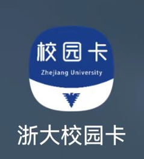

# 浙大校园卡

## 应用图标

## 应用说明

这是由学校官方开发的用于校园卡管理的app，可以很方便的进行校园卡充值，也能替代校园卡在校园内进行相关的消费等。

## 下载地址

<http://ecardhall.zju.edu.cn:808/Category/PageDetails?newsdetailsname=2022011715001087&pagename=ViewDetails&id=83&pid=4&menuname=%E6%9C%80%E6%96%B0%E5%85%AC%E5%91%8A&messageid=1430>

&nbsp;  
&nbsp;  
&nbsp;  

目录：[目录](../Readme.md)  
下一个：[浙大体艺](%E6%B5%99%E5%A4%A7%E4%BD%93%E8%89%BA.md)
