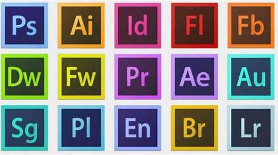

# Adobe

## 应用图标

## 应用说明

包含各式各样的软件，图片修剪、视频剪辑、音频处理、项目设计、海报设计等内容无所不容。对于有兴趣拓宽能力面的同学，学习Adobe全家桶是不二选择。并且学校也提供了免费的下载渠道，可以很方便的获取。

## 下载地址

<http://ms.zju.edu.cn/adobe/download.html>

&nbsp;  
&nbsp;  
&nbsp;  

目录：[目录](../Readme.md)  
上一个：[Clash](Clash.md)  
下一个：[语雀](%E8%AF%AD%E9%9B%80.md)
